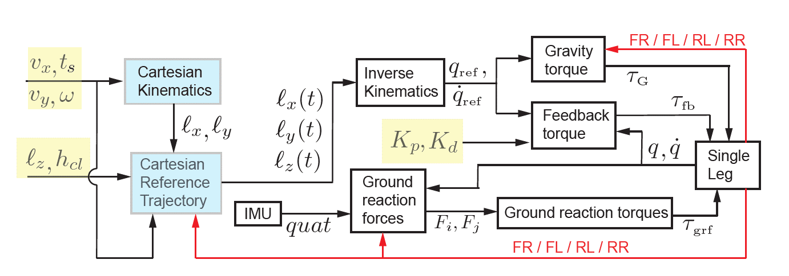
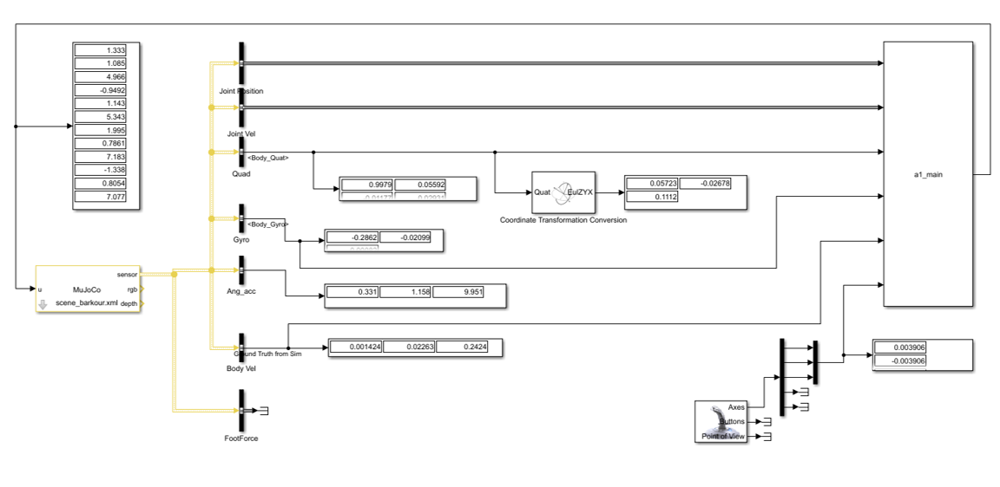

# MuSimQuad

This repository demonstrates a simple controller for omnidirectional trotting of quadrupedal robots based on [1]. The control workflow is shown in Figure 1, implemented in MATLAB/Simulink, and compiled as an S-Function (MEX). A joystick interface is integrated for real-time command inputs.

---
## Figures
- **Figure 1**: Control workflow of the controller  
  
  
- **Figure 2**: Simulink project screenshot  
  

---
## Videos

https://github.com/user-attachments/assets/09fb78de-fa7f-4c1b-a002-975af15f024b

*Video 1: Simulation video showing the controller in action on Simulink*

https://github.com/user-attachments/assets/15e9dee3-bda6-4d0b-9ed0-5b65e54f338b

*Video 2: Simulation video demonstrating the controller with a different scene*

---

## Installation
1. Install the MuJoCo Simulink Blockset from [2].  
2. Clone or download this repository.  
3. Open the Simulink model (`.slx`) in MATLAB.  
4. In the MuJoCo plant block, select the `scene.xml` file for the simulation environment.  
5. Ensure MuJoCo is properly configured before running the simulation.
---

## References
[1] A Simple Controller for Omnidirectional Trotting of Quadrupedal Robots: Command Following and Waypoint Tracking by Pranav A. Bhounsule and Chun-Ming Yang

[2] “MuJoCo Simulink Blockset,” [Online]. Available: [https://github.com/mathworks-robotics/mujoco-simulink-blockset](https://github.com/mathworks-robotics/mujoco-simulink-blockset)
